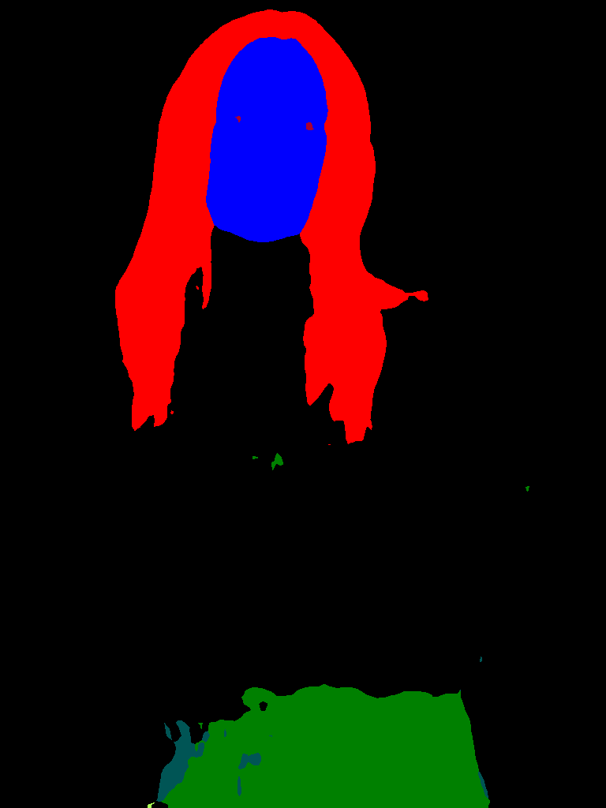

# Human Parsing (Human body Part segmentation) using PyTorch

### Results:
  


Citation:
```
@InProceedings{Liu_2022_CVPR,
    author    = {Liu, Kunliang and Choi, Ouk and Wang, Jianming and Hwang, Wonjun},
    title     = {CDGNet: Class Distribution Guided Network for Human Parsing},
    booktitle = {Proceedings of the IEEE/CVF Conference on Computer Vision and Pattern Recognition (CVPR)},
    month     = {June},
    year      = {2022},
    pages     = {4473-4482}
}
```

